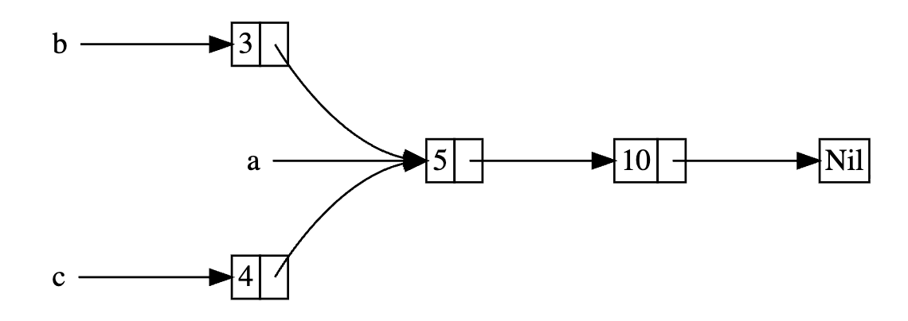

## 15.3 : Running Code on Cleanup with the Drop Trait

`Drop` trait is almost always used when implementing a smart pointer. eg: when a `Box<T>` is dropped, it will deallocate the space on the heap that the box points to. We need to specify the code to run when a value goes out of scope by implementing the `Drop` trait. The `Drop` trait requires us to implement one method named `drop` that takes a mutable reference to `self`. eg:

```rust
struct CustomSmartPointer{
    data: String,
}

impl Drop for CustomSmartPointer {
    fn drop(&mut self) {
        println!("Dropping CustomSmartPointer with data: {} !",self.data);
    }
}

fn main() {
    let c = CustomSmartPointer{
        data: String::from("my stuff"),
    };
    let d = CustomSmartPointer{
        data: String::from("other stuff"),
    };
    println!("CustomSmartPointers created");
}
```

Output :

```rust
$ cargo run
   Compiling drop-example v0.1.0 (file:///projects/drop-example)
    Finished `dev` profile [unoptimized + debuginfo] target(s) in 0.60s
     Running `target/debug/drop-example`
CustomSmartPointers created
Dropping CustomSmartPointer with data `other stuff`!
Dropping CustomSmartPointer with data `my stuff`!
```

The `Drop` Trait is included in the prelude, so we don't need to bring it into scope. We implement the `Drop` trait on `CustomSmartPointer` and provide an implementation for the `drop` method that calls `println!`. The body of the `drop` method is where we would place any logic that we wanted to run when an instance of our type goes out of scope. Note: We don't need to call the `drop` method explicitly.

Rust automatically called `drop` for us when our instances went out of scope, calling the code we specified. Variables are dropped in the *reverse order*  of their creation, so `d` was dropped before `c`.

Unfortunately, it's not straightforward to disable the automatic `drop` functionality. Disabling `drop` isn't usually necessary, the whole point of the `Drop` trait is that it's taken care of automatically. Rust doesn't lets use call the `Drop` trait's `drop` method manually, instead we have to call the `std::mem::drop` function provided by the standard library if we want to force a value to be dropped before the end of it's scope.

The `std::mem::drop` function is different from the `drop` method in the `Drop` trait. We call it by passing as an argument the value we want to force-drop. The function is in prelude, so we can modify the `main` to call the `drop` function. eg:

```rust
fn main() {
    let c = CustomSmartPointer{
        data: String::from("some data"),
    };
    println!("CustomSmartPointer created");
    drop(c);
    println!("CustomSmartPointer dropped before the end of main");
}
```

Output:
```bash
$ cargo run
   Compiling drop-example v0.1.0 (file:///projects/drop-example)
    Finished `dev` profile [unoptimized + debuginfo] target(s) in 0.73s
     Running `target/debug/drop-example`
CustomSmartPointer created
Dropping CustomSmartPointer with data `some data`!
CustomSmartPointer dropped before the end of main
```


## 15.4 : `Rc<T>`, the Reference-Counted Smart Pointer

There are cases when a single value might have multiple owners, like in graph data structures, multiple edges might point to the same node, and that node is conceptually owned by all of the edges that point to it. A node shouldn't be cleaned up unless it doesn't have any edges pointing to it and so has no owners.

In such cases, we have to enable multiple ownership explicitly by using the Rust type `Rc<T>`, which is an abbreviation for *reference counting*. The `Rc<T>` type keeps track of the number of references to a value to determine whether or not the value is still in use. If there are zero references to a value, the value can be cleaned up without any references becoming invalid.

We use the `Rc<T>` type when we want to allocate some data on the heap for multiple parts of our program to read and we can't determine at compile time which part will finish using the data last. Note: `Rc<T>` is only for use in single-threaded scenarios. 

#### Sharing Data



```rust
enum List{
    Cons(i32, Box<List>),
    Nil,
}

use crate::List::{Cons, Nil};

fn main(){
    let a = Cons(5, Box::new(Cons(10, Box::new(Nil))));
    let b = Cons(3, Box::new(a));
    let c = Cons(4, Box::new(a));
}
```

Output:
```bash
$ cargo run
   Compiling cons-list v0.1.0 (file:///projects/cons-list)
error[E0382]: use of moved value: `a`
  --> src/main.rs:11:30
   |
 9 |     let a = Cons(5, Box::new(Cons(10, Box::new(Nil))));
   |         - move occurs because `a` has type `List`, which does not implement the `Copy` trait
10 |     let b = Cons(3, Box::new(a));
   |                              - value moved here
11 |     let c = Cons(4, Box::new(a));
   |                              ^ value used here after move
   |
note: if `List` implemented `Clone`, you could clone the value
  --> src/main.rs:1:1
   |
 1 | enum List {
   | ^^^^^^^^^ consider implementing `Clone` for this type
...
10 |     let b = Cons(3, Box::new(a));
   |                              - you could clone this value

For more information about this error, try `rustc --explain E0382`.
error: could not compile `cons-list` (bin "cons-list") due to 1 previous error
```

The error is caused because: the `Cons` variant own the data they hold, so when we create `b` list, `a` is moved into `b` and `b` owns `a`. Then when we try to use `a` again when creating `c`, we are not allowed to because `a` has been moved.

Solution: Use `Rc<T>` instead of `Box<T>` and clone `Rc<List>` that `a` is holding, thereby increasing the number of references from one to more. eg:

```rust
enum List{
    Cons(i32, Rc<List>),
    Nil,
}

use crate::List::{Cons, Nil};
use std::rc::Rc;

fn main() {
    let a = Rc::new(Cons(5, Rc::new(Cons(10, Rc::new(Nil)))));
    let b = Cons(3, Rc::clone(&a));
    let c = Cons(4, Rc::clone(&a)); 
    /* Meaning: “Let c be a Cons node with value 4, and the second element is a cloned reference to a.” */
}
```

Refer to the documentation of `Cons` for more details: [Struct Cons](https://docs.rs/lexpr/latest/lexpr/struct.Cons.html)

Cloning to increase the Reference Count
```rust
enum List{
    Cons(i32, Rc<List>),
    Nil,
}

use crate::List::{Cons, Nil};
use std::rc::Rc;

fn main() {
    let a = Rc::new(Cons(5, Rc::new(Cons(10, Rc::new(Nil)))));
    println!("count after creating a: {}", Rc::strong_count(&a));
    
    let b = Cons(3, Rc::clone(&a));
    println!("count after creating b: {}", Rc::strong_count(&a));

    {
        let c = Cons(4, Rc::clone(&a));
        println!("count after creating c: {}", Rc::strong_count(&a));
    }

    println!("count after c goes out of scope: {}", Rc::strong_count(&a));
}
```

Output:
```bash
$ cargo run
   Compiling cons-list v0.1.0 (file:///projects/cons-list)
    Finished `dev` profile [unoptimized + debuginfo] target(s) in 0.45s
     Running `target/debug/cons-list`
count after creating a = 1
count after creating b = 2
count after creating c = 3
count after c goes out of scope = 2
```

At each point in the program where the reference count changes, we print the reference count, which we get by calling the `Rc::strong_count` function. The function is named `strong_count` rather than count because the `Rc<T>` type also has a `weak_count`, which is used in *`Preventing Reference Cycles using Weak<T>`*.

We don't have to call a function to decrease the reference count like we have to call `Rc::clone` to increase the reference count. The implementation of the `Drop` trait decreases the reference count automatically when an `Rc<T>` value goes out of scope. Using `Rc<T>` allows a single value to have multiple owners, and the count ensures that the value remains valid as long as any of the owners still exist. 

Via immutable references `Rc<T>` allows us to share data between multiple parts of our program for reading only. If `Rc<T>` allowed us to have multiple mutable references too, we might violate one of the borrowing rules. Multiple mutable borrows to the same place can cause data races and inconsistencies.


## 15.5 : `RefCell<T>` and the Interior Mutability Pattern

Interior mutability is a design pattern in Rust that allows us to mutate data even when there are immutable references to that data; normally this action is disallowed by the borrowing rules. To mutate data, the pattern uses `unsafe` code inside the data structure to bend Rust's usual rules that govern mutation and borrowing. Unsafe code indicates to the compiler that we are checking the rules manually instead of relying on the compiler to check them for us.

We can use types that use the interior mutability pattern only when we can ensure that the borrowing rules will be followed at runtime, even though the compiler can't guarantee that. The `unsafe` code involved is then wrapped in a safe APU, and the outer type is still immutable.

`RefCell<T>` follows the interior mutability pattern. 

There are situations in which it would be useful for a value to mutate itself in its methods but appear immutable to other code. Code outside the value's method would not be able to mutate the value. Using `RefCell<T>` is one way to get the ability to have interior mutability, but `RefCell<T>` doesn't get around the borrowing rules completely : The borrow checker in the compiler allows this interior mutability, and borrowing rules are checked at runtime instead. If we violate the rules, we'll get a `panic!` instead of a compiler error.


#### Eg: Testing with Mock Objects

Sometimes during testing a programmer will use a type in place of another type, in order to observe particular behaviour and assert that it's implemented correctly. This placeholder type is called a test double. Test doubles stand in for other types when we are running tests. Mock objects are specific types of test doubles that record what happens during a test so that you can assert that the correct actions took place.

eg: We need a mock object that, instead of sending an email or text message when we call send, will keep track of the messages it's told to send. 

```rust
pub trait Messenger {
    fn send(&self, msg: &str);
}

pub struct LimitTracker<'a, T: Messenger> 
// public struct LimitTracker with lifetime 'a and type T constrained to implement the Messenger trait
{         
    messenger: &'a T,
    value: usize,
    max: usize,
}

impl<'a, T> LimitTracker<'a, T>  
// impl of lifetime a and type T for LimitTracker of lifetime a and type T. Meaning: 
// we are declaring a lifetime 'a and a generic type T, for the struct LimitTracker using that lifetime and type
// we are implementing methods for LimitTracker that is parameterized by a lifetime 'a and a generic type T.

where 
    T: Messenger, 
{
    pub fn new(messenger: &'a T, max: usize) -> LimitTracker<'a, T> {
        LimitTracker{
            messenger,
            value: 0,
            max,
        }
    }       

    pub fn set_value(&mut self, value: usize) {
        self.value = value;

        let percentage_of_max = self.value as f64 / self.max as f64;

        if percentage_of_max >= 1.0 {
            self.messenger.send("Error: You are over your quota!");
        } else if percentage_of_max >= 0.9 {
            self.messenger.send("Urgent Warning: You have used up 90% of your quota!");
        } else if percentage_of_max >= 0.75 {
            self.messenger.send("Warning: You have used up over 75% of your quota!");
        }
    }
}

#[cfg(test)]
mod tests {
    use super::*;

    struct MockMessenger {
        sent_messages: Vec<String>,
    }

    impl MockMessenger {
        fn new() -> MockMessenger {
            MockMessenger{
                sent_messages: vec![],
            }
        }
    }

    impl Messenger for MockMessenger {
        fn send(&self, message: &str) {
            self.sent_messages.push(String::from(message));
        }
    }

    #[test]
    fn it_sends_an_over_75_percent_warning_message(){
        let mock_messenger = MockMessenger::new();
        let mut limit_tracker = LimitTracker::new(&mock_messenger, 100);

        limit_tracker.set_value(80);

        assert_eq!(mock_messenger.sent_messages.len(), 1);
    }
}
```

One important part of this code is that the Messenger trait has one method called send that takes an immutable reference to self and the text of the message. This trait is the interface our mock object needs to implement so that the mock can be used in the same way a rea object is. We need a mock object that instead of sending an email or text message when we call send, will only keep track of the messages it's told to send. We can create a new instance of the mock object, create a LimitTracker that uses the mock object, call the set_value method on LimitTracker and then check that the mock object has the messages we expect. But on doing so, the borrow checker won't allow it.

```bash
$ cargo test
   Compiling limit-tracker v0.1.0 (file:///projects/limit-tracker)
error[E0596]: cannot borrow `self.sent_messages` as mutable, as it is behind a `&` reference
  --> src/lib.rs:58:13
   |
58 |             self.sent_messages.push(String::from(message));
   |             ^^^^^^^^^^^^^^^^^^ `self` is a `&` reference, so the data it refers to cannot be borrowed as mutable
   |
help: consider changing this to be a mutable reference in the `impl` method and the `trait` definition
   |
 2 ~     fn send(&mut self, msg: &str);
 3 | }
...
56 |     impl Messenger for MockMessenger {
57 ~         fn send(&mut self, message: &str) {
   |

For more information about this error, try `rustc --explain E0596`.
error: could not compile `limit-tracker` (lib test) due to 1 previous error
```

We can't modify the `MockMessenger` to keep track of the messages, because the send method takes an immutable reference to `self`. This is a situation in which interior mutability can help. We'll store the `sent_messages` within a `RefCell<T>`, and then the `send` method will be able to modify `sent_messages` to store the messages we've seen.

```rust
#[cfg(test)]
mod tests {
    // use everything from the parent module. 
    // super refers to the parent module and * means import everything from it.
    // bring all items from the parent module into scope
    use super::*;
    
    // bring RefCell from std::cell into scope
    // std -> standard library | cell -> Module | RefCell -> Type
    // we are importing RefCell from the standard library's cell module
    use std::cell::RefCell;
    

    struct MockMessenger{
        sent_messages: RefCell<Vec<String>>,
    }

    impl MockMessenger{
        fn new() -> MockMessenger {
            MockMessenger{
                sent_messages: RefCell::new(vec![]),
            }
        }
    }

    impl Messenger for MockMessenger{
        fn send(&self, message: &str){
            self.sent_messages.borrow_mut().push(String::from(message));
        }
    }

    #[test]
    fn it_sends_an_over_75_percent_warning_message(){
        let mock_messenger = MockMessenger::new();
        let mut limit_tracker = LimitTracker::new(&mock_messenger, 100);

        limit_tracker.set_value(80);

        assert_eq!(mock_messenger.sent_messages.borrow().len(),1);
    }
}

// RefCell<T> : - Reference Cell holding type T 
//              - RefCell is a smart pointer that allows interior mutability, meaning we can mutate data even when the RefCell itseld is immutable
```

The `sent_messages` field is now of type `RefCell<Vec<String>>` instead of `Vec<String>`. In the `new` function, we create a new `RefCell<Vec<String>>` instance around the empty vector. We call `borrow_mut` on the `RefCel<Vec<String>>` in `self.sent_messages` to get a mutable refernce to the value inside the `RefCell<Vec<String>>` which is the vector. Then we can call `push` on the mutable reference to the vector to keep track of the messages sent during the test.

#### Tracking Borrows at Runtime

When creating immutable and mutable references, we use the `&` and `&mut` syntax respectively. With `RefCell<T>`, we use the `borrow` and `borrow_mut` methods which are part of the safe API that belongs to the `RefCell<T>`. The `borrow` method returns the smart pointer type `Ref<T>`, and `borrow_mut` returns the smart pointer type `RefMut<T>`. Both types implement `Deref`, so we can treat them like regular references.

The `RefCell<T>` keeps track of many `Ref<T>` and `RefMut<T>` smart pointers are currently active. Every time we call borrow, the `RefCell<T>` increases its count of how many immutable borrows gors down by 1. Just like the compile-time borrowing rules, `RefCell<T>` lets us have many immutable borrows or one mutable borrow at any point in time. If we try to violate these rules, rather than getting a compiler error as we would with references, the implementation of `RefCell<T>` will panic at runtime.

eg:
```rust
impl Messenger for MockMessenger{
    fn send(&self, message: &str) {
        let mut one_borrow = self.sent_messages.borrow_mut();
        let mut two_borrow = self.sent_messages.borrow_mut();

        one_borrow.push(String::from(message));
        two_borrow.push(String::from(message));
    }
}
```

Output:
```bash
$ cargo test
   Compiling limit-tracker v0.1.0 (file:///projects/limit-tracker)
    Finished `test` profile [unoptimized + debuginfo] target(s) in 0.91s
     Running unittests src/lib.rs (target/debug/deps/limit_tracker-e599811fa246dbde)

running 1 test
test tests::it_sends_an_over_75_percent_warning_message ... FAILED

failures:

---- tests::it_sends_an_over_75_percent_warning_message stdout ----

thread 'tests::it_sends_an_over_75_percent_warning_message' panicked at src/lib.rs:60:53:
RefCell already borrowed
note: run with `RUST_BACKTRACE=1` environment variable to display a backtrace


failures:
    tests::it_sends_an_over_75_percent_warning_message

test result: FAILED. 0 passed; 1 failed; 0 ignored; 0 measured; 0 filtered out; finished in 0.00s

error: test failed, to rerun pass `--lib`
```

#### Allowing Multiple Owners of Mutable Data

A common way to use `RefCell<T>` is in combination with `Rc<T>`. Recall that `Rc<T>` lets you have multiple owners of some data, but it only gives immutable access to that data. If we have an `Rc<T>` that holds a `RefCell<T>`, we can get a value that can have multiple owners and that we can mutate.

```rust
#[derive(Debug)]
enum List{
    Cons(Rc<RefCell<i32>>, Rc<List>),
    Nil,
}

use crate::List::{Cons, Nil};
use std::cell::RefCell;
use std::rc::Rc;

fn main(){
    let value = Rc::new(RefCell::new(5));
    let a = Rc::new(Cons(Rc::clone(value), Rc::new(Nil)));
    let b = Cons(Rc::new(RefCell::new(3)), Rc::clone(&a));
    let c = Cons(Rc::new(RefCell::new(4)), Rc::clone(&a));

    *value.borrow_mut() += 10;

    println!("a after = {a:?}")
    println!("b after = {b:?}")
    println!("c after = {c:?}")
}
```

Output:
```bash
$ cargo run
   Compiling cons-list v0.1.0 (file:///projects/cons-list)
    Finished `dev` profile [unoptimized + debuginfo] target(s) in 0.63s
     Running `target/debug/cons-list`
a after = Cons(RefCell { value: 15 }, Nil)
b after = Cons(RefCell { value: 3 }, Cons(RefCell { value: 15 }, Nil))
c after = Cons(RefCell { value: 4 }, Cons(RefCell { value: 15 }, Nil))
```